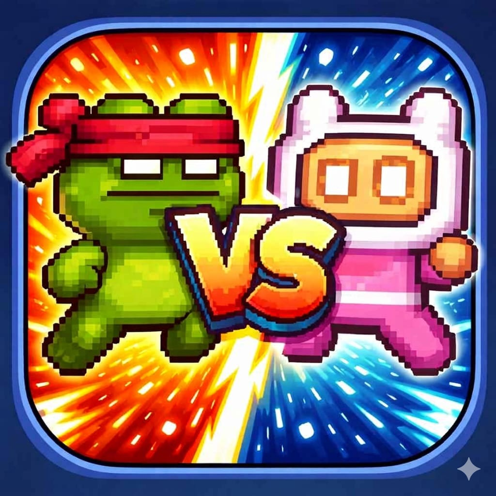

# Duality

**Duality** is a fast-paced, 2D multiplayer PvP pixel art game built with the Godot Engine. Compete against your friends in a physics-based arena where every push counts!

## 🎮 Game Features

- **Real-Time Multiplayer**: Seamless peer-to-peer gameplay powered by WebRTC and Firebase connectivity.
- **Dynamic Room System**: Easily host a match or join a friend using a simple 4-character room code.
- **Character Selection**: Choose your style with four unique characters:
  - Mask Dude
  - Ninja Frog
  - Pink Man
  - Virtual Guy
- **Customizable Matches**: Hosts can set the pace by choosing match durations of 60, 90, or 120 seconds.
- **Competitive Scoring**: Push the boxes into your designated zone to rack up points!
  - **Red Zone (Left)**: Host's scoring area.
  - **Blue Zone (Right)**: Guest's scoring area.
- **High Mobility**: Master the triple jump to navigate the arena and outmaneuver your opponent.
- **Cross-Platform Support**: Responsive controls for both Desktop (Keyboard) and Mobile (Touch).

## 🚀 How to Play

1.  **Start Your Journey**: Enter your username and select your character on the main screen.
2.  **Join the Lobby**:
    - **Hosting**: Click "Create Room," select your match duration, and share the room code with your friend.
    - **Joining**: Click "Join Room" and enter the code provided by the host.
3.  **The Match**:
    - Once both players are ready in the Waiting Room, the match begins!
    - Push the boxes in the arena toward your colored zone.
    - Keep an eye on the clock—the player with the most points when time runs out wins!

## 🕹️ Controls

| Action | Desktop (Keyboard) | Mobile (Touch) |
| :--- | :--- | :--- |
| **Move Left** | `A` or `Left Arrow` | Left Arrow Button |
| **Move Right** | `D` or `Right Arrow` | Right Arrow Button |
| **Jump** | `Space` | Jump Button |
| **Triple Jump** | Press `Space` in mid-air | Tap Jump in mid-air |

## 🛠️ Technical Stack

- **Engine**: [Godot Engine 4.4](https://godotengine.org/)
- **Backend/Signaling**: [Firebase Realtime Database](https://firebase.google.com/)
- **Networking**: WebRTC P2P
- **Assets**: Pixel Adventure by Pixel Frog

---
*Created with ❤️ for Duality players.*
